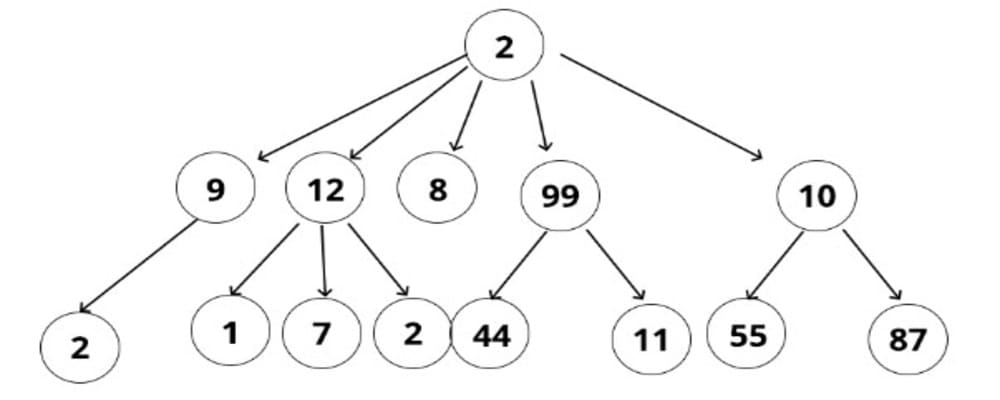
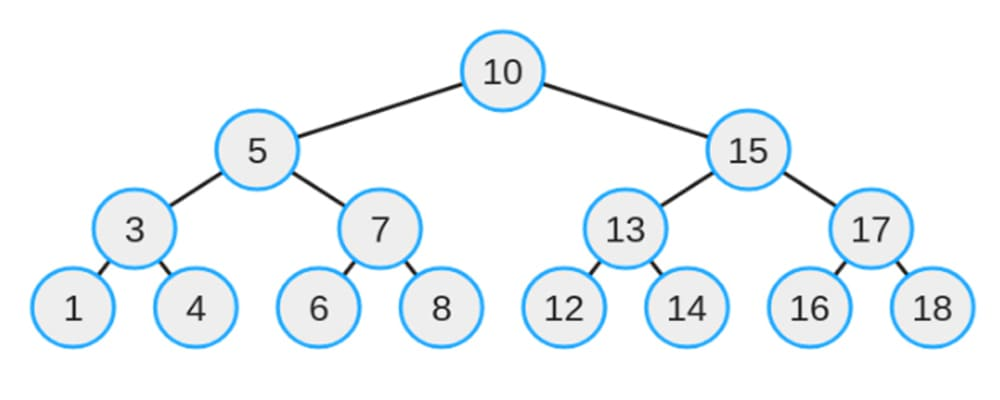
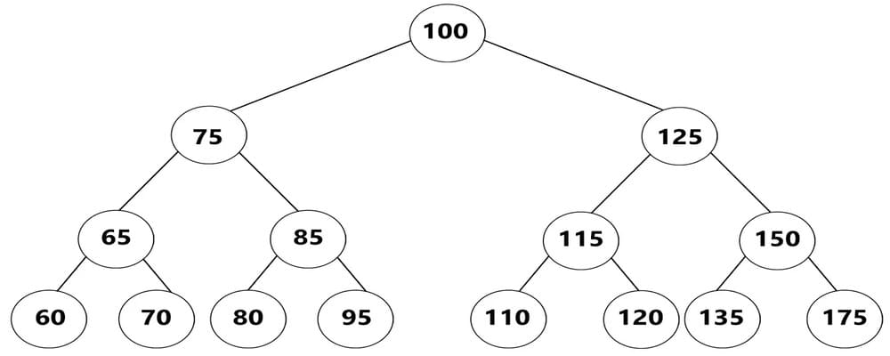

# Data Structure
## Queue
First in - first out

## Stack 
Last in - first out

## Tree
Trees - this is a recursive data structure where each node is also a tree, but for a given tree, each node is a subtree

# Binary Tree
Binary tree - this is a recursive data structure where each node is a tree, each node can only have 2 children.

These nodes are added in a special way, if the value added to the tree is greater than the value in the node, then it goes to the right side, if less then to the left

# Graph
Graph - an abstract data structure is a set of vertices and connections between them

