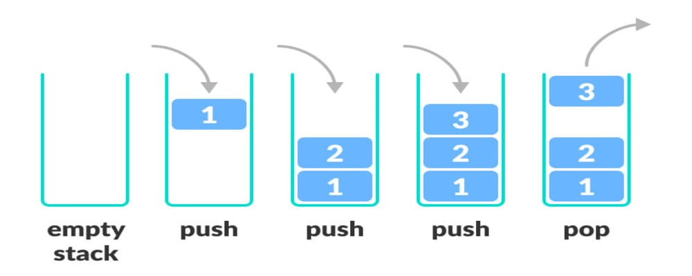
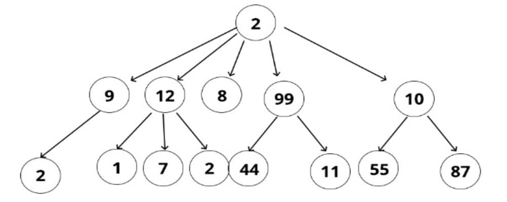
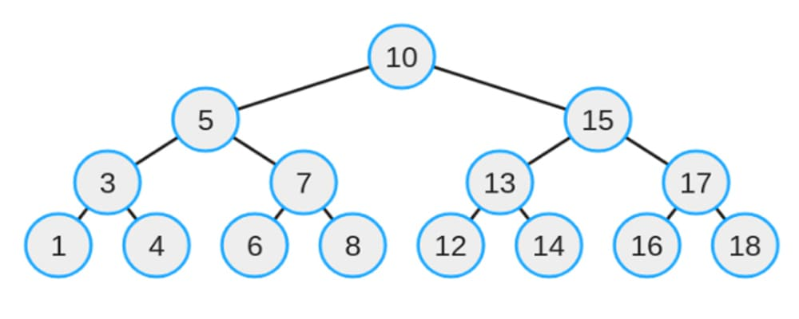
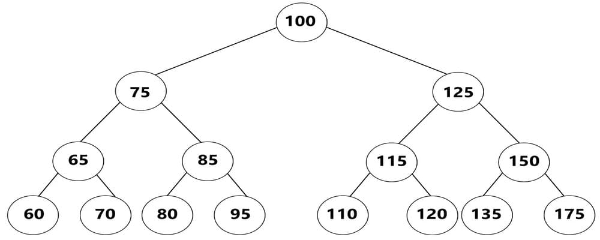
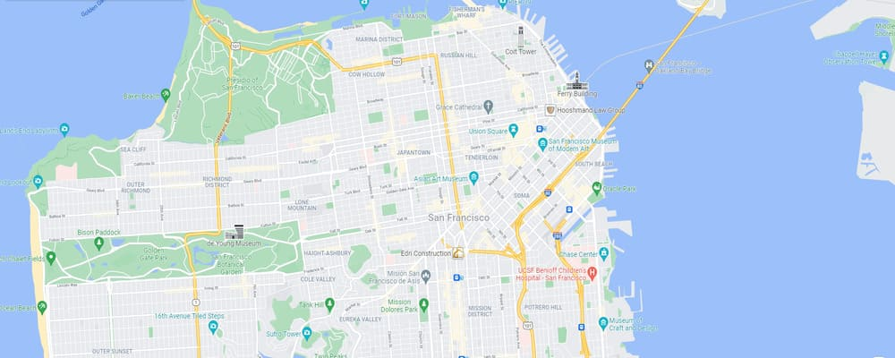
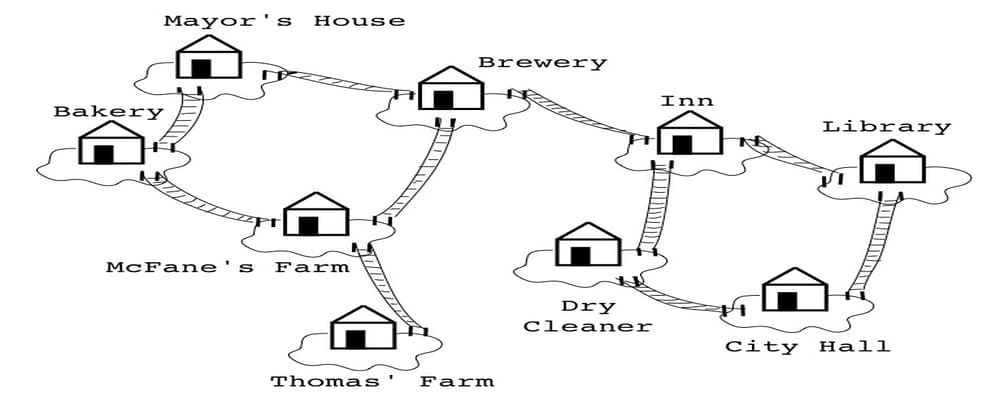
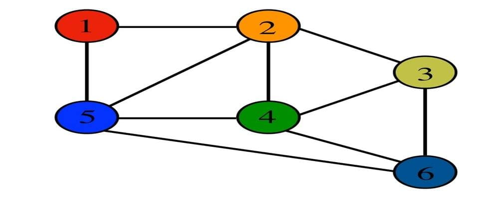
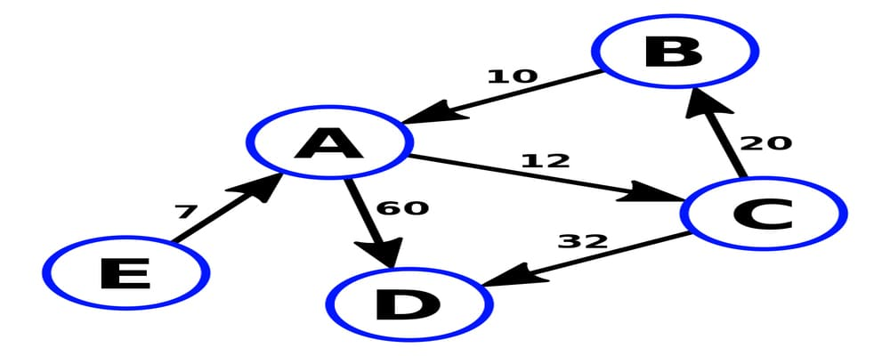
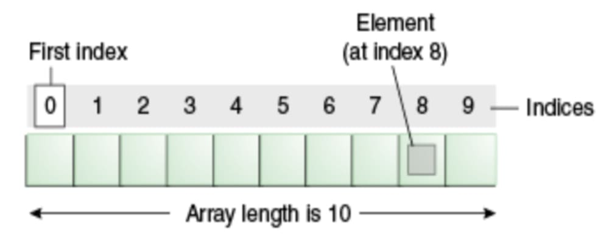
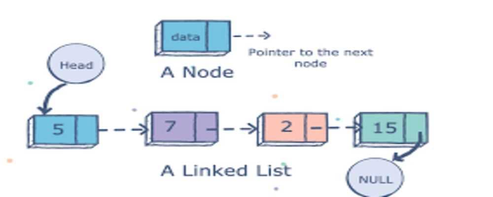

# Data Structure
## Queue
First in - first out

![Queue - 2]./img/queue_2.jpg)

## Stack 
Last in - first out

## Tree
Trees - this is a recursive data structure where each node is also a tree, but for a given tree, each node is a subtree

# Binary Tree
Binary tree - this is a recursive data structure where each node is a tree, each node can only have 2 children.

These nodes are added in a special way, if the value added to the tree is greater than the value in the node, then it goes to the right side, if less then to the left

# Graph
Graph - an abstract data structure is a set of vertices and connections between them

# Array
Array - a sequential set of any objects, occupies a strictly defined storage place

# Linked List
Linked list - a sequential set of any objects, the number of elements is not strictly defined, but to find the desired element, you need to go through all the objects from the beginning of the list

# Map
Stores key-value pairs. By providing a key, we get the value corresponding to this key

