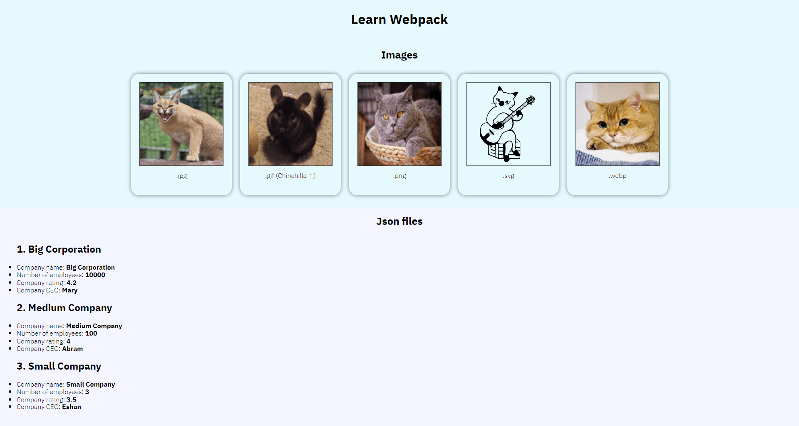

# Webpack
### In this folder, I work with webpack
### I understood how to work with the following types of files using Webpack
+ ttf woff woff2 eot
+ png jpg svg gif webp
+ json xml csv
+ js jsx ts (babel compiler)
+ sass scss css
### I also understood
+ How better make build in mode development and in mode production
+ Learned how point the way in webpack
+ How work with webpack-dev-server
+ Collect statistics and optimize builds using webpack-bundle-analyzer
+ How work witch eslint
+ Optimize html css js for production builds

yarn add -D @babel/core @babel/plugin-proposal-class-properties @babel/polyfill @babel/preset-env @babel/preset-react @babel/preset-typescript babel-eslint babel-loader clean-webpack-plugin cross-env css-loader eslint eslint-loader file-loader html-webpack-plugin mini-css-extract-plugin mini-css-extract-plugin optimize-css-assets-webpack-plugin postcss-loader sass sass-loader scss-loader style-loader terser-webpack-plugin webpack webpack-bundle-analyzer webpack-cli webpack-dev-server xml-loader

"scripts": {

    "dev": "cross-env NODE_ENV=development webpack --mode development",

    "build": "cross-env NODE_ENV=production webpack --mode production",

    "watch": "cross-env NODE_ENV=development webpack --mode development --watch",

    "start": "cross-env NODE_ENV=development webpack-dev-server --mode development --open",

    "stats": "webpack --json > stats.json && webpack-bundle-analyzer stats.json"

  }

